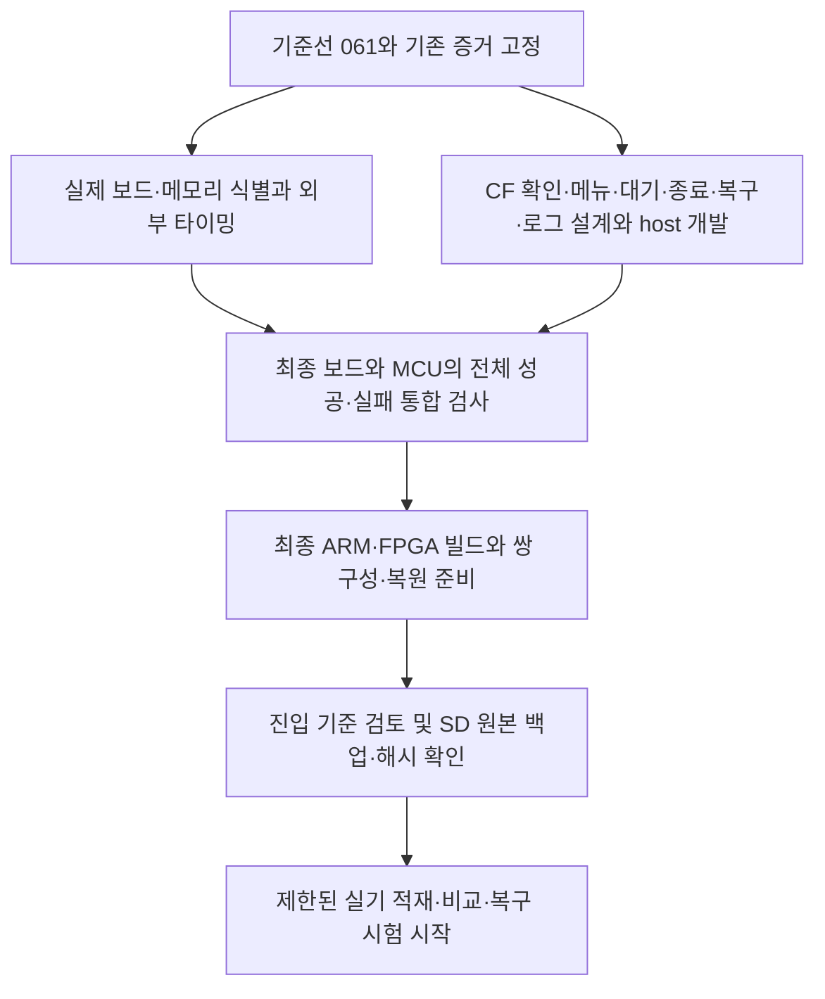

# NES 실기 진입 전 공정 점검과 진행 가이드

현재104: 실제 timer·SysTick·LED·CIC·RESET 감지를 메뉴 복귀 경로에 연결했다. SysTick의 카드 상태 변경 알림이 진단 중 전역 printf 상태에 재진입하는 문제를 수정했다.

[104 결과](../../analysis/TIMER104-RESULT.ko.md)와 [현재 인계](../../cores/nes/HANDOFF.ko.md)를 먼저 읽는다. 104 최종 ARM과097 동일 fit FPGA·정확044 복원 파일의 조합을 고정하고, 외부IO/공통고장 및 정상·실패 관측 절차를 검토해 제한 실기 가능 범위를 결정한다. 준비도4완료/7부분/1미완료, 설치 미승인. 아래 과거 표와 구분한다.

## 1. 판단과 목표

기반 회로와 파일 검증은 계획대로 쌓였다. 다만 **구성요소별 검증 진척에 비해 사용자가 실행하고 결과를 판단할 수 있는 통합 경로가 뒤처져 있다.** 다음 우선순위는 추가 코어 기능이 아니라 실기 진단 한 건을 끝까지 실행하고 복구하는 경로다. 약속된 완료 날짜나 공수 기준선이 없으므로 일정 준수율은 산정하지 않는다.

가장 가까운 실기 목표는 아래 한 가지로 고정한다.

> 승인된 자체 진단 파일을 SD에서 읽고 → PSRAM에 적재하고 → 전 바이트를 다시 읽어 비교하고 → START 없이 STOP하고 → 기본 FPGA와 메뉴를 복구하며 → 성공·실패·복구 결과를 읽을 수 있게 남긴다.

이 목표는 NES 일반 게임의 CPU/PPU/오디오/입력/저장 완성과 다르다. 전체 코어의 4 LAB 여유 문제나 완전한 SNES 영상 소비자를 먼저 해결할 필요는 없다. 대신 이 진단이 사용하는 실제 핀·메모리·복구 경로는 검증해야 한다. 기존 044 화면 순환 및 GBC 정상 플레이 관측은 그대로 보존한다.

## 2. 실기 시작 전 진척도

### 확정된 개발 대상과 추가 확인 항목

2026-10-07 추가 관측: [하드웨어 식별·PSRAM 규격 가이드](FXPAK-HARDWARE-REFERENCE.ko.md)에 HWINFO002 실기 TXT, 사용자 기판 사진의 PSRAM 두 칩/FPGA/SRAM 각인, 실제 EBLL 데이터시트 검증을 반영했다. 후속 확대 사진으로 MCU STM32F401RCT6도 확인했으며 사용자의 다음 작업 요청으로 [외부 타이밍 검토](NES-PSRAM-TIMING-REVIEW.ko.md)를 재개했다. 실제 RTL3대조로 주소/CE 상대 지연의 미검증 경계를 확인했으며 신규 생산 RTL/실기 적재는 없다. H05는 부분, H06은 미완료이며 준비도 집계는 그대로다.

**FXPAK Pro / Mk.III, STM32 + EP4CE15F17C8은 이미 저장소에 명시된 개발 대상이다.** [루트 README](../../README.md), [기종 등록부](../../cores/registry.json)의 `target_board`를 기준으로 고정하며, 이 정보를 사용자에게 다시 질문하지 않는다. 앞선 점검에서 알려진 대상 사양을 가이드에 옮기지 않고 미확인 사항만 적어 혼동을 만들었으므로 062 작업 중 보완했다.

| 구분 | 저장된 근거와 취급 |
| --- | --- |
| 보드/MCU/FPGA | FXPAK Pro / Mk.III, STM32, EP4CE15F17C8. 알려진 개발·빌드 대상 |
| 실제 리비전/MCU 관측 | HWINFO002 실기 TXT의 GPIO 스트랩 `0xC4`가 FXPAK Pro Rev.D를 가리킨다. MCU DEV_ID `0x423`, Flash256KiB. 확대 사진의 STM32F401RCT6와 일치하며 PCB 실크도 Rev.D로 확인했다 |
| 메모리의 기존 표기 | [인터페이스 계약](../interfaces.md): PSRAM 총16MiB/16비트/70ns, SRAM512KiB/8비트/45ns. 고정 sd2snes MK3 소스는 PSRAM `2 × 64Mbit`와 두 CE/ZZ 핀을 명시한다. 이는 기존 소스의 설계 표기 |
| PSRAM 실물과 남은 검증 | 사용자 사진의 U501/U502 모두 IS66WVE4M16EBLL-70BLI. 총16MiB/70ns/전원·IO 2.7–3.6V 규격과 EBLL Rev.D3 min/max는 [공통 가이드](FXPAK-HARDWARE-REFERENCE.ko.md)에 기록했다. 탑재 코드/속도 식별은 해결됐으며 배선·실제 전압·외부 IO 제약·보드 여유 검증은 남는다 |
| 관측하는 방법 | 기존 플랫폼 `get_hwinfo`가 모델·revision을 읽고 부트 안내에 표시한다. 이미 읽은 정보를 향후 안전한 결과 로그에서 재사용하는 경로를 먼저 검토한다. 이 함수는 GPIO/SD DAT mask를 바꾸므로 진단 중 무분별하게 재호출하지 않는다 |

추가 질문 전에는 위 자료와 기존 로그·빌드 입력부터 확인하고, 무엇이 알려져 있고 어떤 정확한 항목만 부족한지 기록한다. 보드 제품명을 모른다는 이유로 호스트/메뉴 개발을 멈추지 않는다. 기존 70ns 표기를 전체 데이터시트 타이밍 보증으로 확대하지 않는다.

**12개 준비 항목 중 완료4 / 부분 완료7 / 미완료1.** H10은070의 고정 소스 세션에서는 완료였으나,077 변경을 포함한 현재 전체 통합은 부분이다. 과거 성공 증거를 취소한 것이 아니다. 이 집계는 제한 진단 준비도이며 공수·일정·NES 제품 완성률로 환산하지 않는다. 실기 진입 승인은 아직 미완료다.

| ID | 준비 항목 | 상태 | 확인된 근거 | 완료로 바뀌는 조건 |
| --- | --- | --- | --- | --- |
| H01 | 진단 범위·기준선·변경 이력 | 완료 | CPU/PPU 없는 범위, 044/GBC 보존, 주요 PR·원시 근거 분리 | 이 범위 유지. 실제 설치 파일 백업은 H12에서 확인 |
| H02 | SPI 적재·읽기·순서 ACK·무결성 제어 | 완료 | 059 제어/전체 길이 모형/오류 대조와 실제 코어 회귀 | 구성요소 근거 완료. 최종 보드 통합은 H10 |
| H03 | 승인된 SD 원본과 MCU 비교 로직 | 완료 | 060의 41 수명주기·18 입력 거부, CRC/close 대조, ARM 링크 | 구성요소 근거 완료. 메뉴에서 호출되는 최종 펌웨어는 H07/H11 |
| H04 | 진단 top·물리 핀 배치·내부 타이밍 | 완료 | 068의135핀/PLL1,195LAB/44M9K,내부최소hold0.140ns,초기대기·등록형reader·START이중차단 | 외부 타이밍과 실제 장착 보드 적합성은 H05/H06 |
| H05 | 실제 보드·PSRAM·배선 규격 식별 | 부분 | Rev.D 실크/스트랩·F401 그룹/Flash256KiB 로그, 사진의 EBLL-70BLI 두 칩과 공식 타이밍 대응 확인 | PSRAM 부품/속도 식별은 완료. 남은 전체 배선·회로 대응과 외부 타이밍 근거를 정리. 확인된 부품/제품 정보는 반복 질문하지 않음 |
| H06 | 외부 IO 타이밍·방향 전환·CDC 검토 | 미완료 | 068내부STA·routed3168경로의조건부FPGA예산. 외부54입력/49출력포트의실제PCB/전압/SPI/SNES승인은미확인 | 아래 전기 타이밍 검토표와 제약·예외의 근거를 닫고 최종 fit/STA 수행 |
| H07 | 메뉴 진입·파일 표시·실제 후보 확인 | 부분 | 069 수동표식/CF68/READY·ARM 호출,076 실제64KiB SRTC 메뉴 제한 승인/853모형 검사 | 최종 같은 설치 쌍으로 브라우저 진입·메뉴 재적재를 관측 |
| H08 | 대기·진행 관측·취소·시간 제한 | 부분 | 하위 호출 예산·보호 구현,077 SD 응답 경계 검사.074 LED는 사용자 외부 관측 불가 확인 | 전체 파일/부팅 시간 예산과 케이스 밖에서 읽을 수 있는 결과·실패 단계·종료 정책 검증 |
| H09 | 오류 종료·기본 FPGA·메뉴 복구·로그 | 부분 | 070 STOP·076 실제 메뉴 프로필/읽기 보호·077 SD 오류 처리 모형/ARM | 최신 같은 쌍의 보고서 저장·기본FPGA·메뉴 복귀/오류/재진입·GBC 실기 |
| H10 | 현재 소스의 디지털 전체성공·오류 회귀 | 부분 | 고정069 C→068 핀의070 전체80/96KiB·ACK/FINISH/STOP은 완료.076 메뉴/077 SD 경계는 별도 모형 | 078 보고서/FatFS/native 호스트 연결116은 완료. 실제 관측 플랫폼/부팅/복귀 연결은 남음.070 재사용은 불변 SPI/RTL 범위로 한정 |
| H11 | 설치할 MCU/FPGA 쌍의 빌드·패키지 | 부분 | 071 동일068 ASM/압축/C 전체 복원+069 ARM 오프라인 쌍 완료.077은 별도 compile-only | 최신 최종 MCU/FPGA/base/menu의 정확한 쌍·manifest·호환성·제한 IO 조건·복원 원본 확인 |
| H12 | 설치 전 백업·복원·관측 계획 | 부분 | 071 사전점검23은 로컬 모형.075 정상044/TXT성공HW002/base/menu 사본 확보·해시 식별 | 전체 SD/GBC/세이브 독립 백업과 실제 복원/재삽입 readback·메뉴/GBC 관측. 없는 before-sdinfo072를 진단 파일로 대체하지 않음 |

근거: [059](../../analysis/SPI-READBACK-RESULT.ko.md), [060](../../analysis/SD-READBACK-RESULT.ko.md), [061](../../analysis/BOARD-DIAGNOSTIC-RESULT.ko.md), [062](../../analysis/MENU-DIAGNOSTIC-RESULT.ko.md), [063](../../analysis/BOARD-SESSION-RESULT.ko.md), [044 실기 관측](../../analysis/H1-HARDWARE-044-RESULT.ko.md). 완료는 각 행에 적힌 범위에만 적용한다.

## 3. 빠지기 쉬운 공정과 판단 기준

### 전체 길이의 성공 경로

최초061의 파형 시험은 오류 복구 검증에 유용하지만 성공한 전체 세션의 증거는 아니었다. 비교 시험의 96KiB 준비도 C의 SD→SPI 전송이 아니라 testbench loader→핀 쓰기다. 059의 전체 성공 근거는 다른 클록/통합 구성이다. 이를 합쳐 최종 보드 세션이 통과했다고 선언하지 않는다.

063은 현재 생산 C/RTL에서80/96KiB 두 형상을 통해 CHR 경계·마지막 바이트·마지막 ACK·FINISH·검증 완료 상태·STOP를 보드 핀까지 연결했다. GPIO/base 복구는 host 모형,실제 메뉴 복귀는 별도다. 최종 변경이 관련 경계를 바꾸면 다시 확인한다. 061에서 차단한 START는 끝까지 보내지 않는다. 전체 로그를 모두 출력할 필요는 없지만 비교 수·첫 실패 주소·기대/실제 값·완료 상태를 저장하고 원본 trace/hash로 추적한다.

빠른 반복에서는 bounded replay와 host 검사를 사용한다. 인터페이스가 고정되면 전체 성공 시험을 수행하고, 최종 후보 변경의 영향이 없는 과거 시험은 재실행 대신 해시·영향 범위로 재사용한다. 시험이 느리다는 이유로 마지막 바이트/FINISH 검사를 생략하거나 MCU의 실제 샘플 시점을 바꾸지 않는다.

### 대기 시간과 RESET 중 관측

[현재 SPI C 코드](../../src/nes/firmware/nes_rom_spi.c)의 명시적 지연은 8바이트 프레임당 278µs다. 적재는 DATA+STATUS 2프레임, 정상적인 첫 poll 완료 비교는 READ+STATUS+ACK 3프레임이다.

| 데이터 크기 | 적재 지연 합 | 추가 비교 지연 합 | 데이터 부분 합계 |
| --- | --- | --- | --- |
| 80KiB | 약 45.5초 | 약 68.3초 | 약 113.9초 |
| 96KiB | 약 54.7초 | 약 82.0초 | 약 136.6초 |

이는 명시적 전송 지연만 합산한 계산이다. SD 읽기·CRC·함수 실행·추가 poll·FPGA 설정·메뉴 복귀 시간이 더해진다. 실측 시간이나 timeout 상한으로 쓰지 않는다. 이전의 68.3/82초를 전체 실행 시간으로 표시하지 않는다.

SNES RESET을 유지하므로 실행 중 화면 갱신이나 SNES 패드 취소를 당연히 사용할 수 있다고 가정하지 않는다. MCU가 RESET을 이미 잡고 있을 때 같은 선의 외부 RESET 버튼을 구별할 수 있는지도 확인해야 한다. 우선 실행 전 읽을 수 있는 후보·대기 안내, 사용 가능한 LED/독립 관측 수단, 복구 후 결과 화면을 검토한다. LED 등의 실제 접근 가능성도 확인 전에는 기능으로 약속하지 않는다. 진행 표시를 위해 CPU RUN을 켜거나 복잡한 영상 소비자를 새로 만들지 않는다.

취소는 DATA/ACK 응답이 불확실한 중간에 같은 명령을 재전송하는 방식으로 구현하지 않는다. 명령 경계에서 STOP 또는 기본 재설정으로 종료한다. 최초 진단에서 실행 중 소프트웨어 취소가 불가능하다면 그 제약과 검증된 종료·복구 방법을 명시적으로 결정한다. 구현되지 않은 취소 버튼을 안내하지 않는다.

### 정지·panic·복구 이후 메뉴

060의 [진입 함수](../../src/nes/firmware/nes_sd_readback.inc)는 SNES RESET을 유지한 채 반환하며, `true`는 진단 성공이 아니라 **메뉴 재적재를 진행해도 되는 상태**다. base FPGA token만 확인했다고 메뉴 복귀가 끝난 것은 아니다. PSRAM 진단 쓰기 뒤 필요한 메뉴 데이터 재적재와 RESET 해제는 호출 경로에서 완성해야 한다.

`fpga_pgm`의 기존 panic, SD/FatFS 내부 대기, 기타 블로킹 호출이 함수 밖의 timeout 검사로 중단된다고 가정하지 않는다. 각 호출의 실제 종료/정지 동작과 MCU watchdog·재부팅 시 안전 상태를 점검하고, 무한 대기를 보고·복구하는 정책을 정한다. USB/SPI 소유권을 조기에 돌려주거나 base 복구 실패 후 일반 메뉴로 진행하지 않는다.

로그는 최소 후보/프로토콜/형상/진행 단계/적재 수/비교 수/오류/STOP 결과/base 복구/메뉴 복구를 구분한다. 설치 파일 SHA256은 패키지 manifest와 SD 읽기 대조로 확인하며 짧은 CF ID만으로 바이너리 동일성을 주장하지 않는다. SD 입력은 읽기 전용으로 유지하고, 로그 저장은 소유권과 파일 닫기·복구가 안전한 별도 시점에 수행한다. SD 고장 때문에 로그를 저장할 수 없는 경우의 표시 방법도 정한다.

### 전기 타이밍과 최초 실기의 역할

필요한 것은 무제한의 사전 물리 측정이 아니라 **실제 부품 자료에 근거한 경계 조건과 제한된 시험의 위험·관측 범위**다. 실기에서 측정해야 할 항목을 이미 측정한 것처럼 요구해 순환 의존을 만들지 않는다.

| 검토 대상 | 실기 전 필요한 근거 | 실기에서 관측할 항목 |
| --- | --- | --- |
| PSRAM | tAA/tOE/tWP/tDS/tDH/tHZ·CE/lane/ZZ·전압·배선 대응, 접근 주기와 여유 | 실제 전 바이트 비교·반복 실행·오류 위치. 화면만으로 전기 여유를 확정하지 않음 |
| MCU SPI/MISO | 실제 GPIO 주기·샘플 시점, synchronizer와 mux 전파·SS 전환, 입출력 min/max 근거 | 후보 ID·응답·오류·총 소요 시간 |
| SNES/미사용 IO | RESET 유지/설정 중과 복구 때 OE/DIR·고임피던스·충돌 방지 | 종료·메뉴 재적재·재진입·GBC 복귀 |
| PLL/reset | lock 상실 assert와 영역별 release, 설정/전원/MCU 재시작 때의 상태 | cold/warm 진입, 종료 후 재실행. 디지털 stub을 아날로그 검증으로 부르지 않음 |

필요한 경로는 실제 제약을 추가한다. 비동기·미사용 경로는 근거와 끝점을 특정해 예외를 검토하고, 전체 IO를 false path로 숨기지 않는다. 남는 미확인 사항은 목록·이유·영향과 함께 판단한다. 전기적 충돌·전압/핀 정체 불명 같은 필수 조건을 단순히 “실기에서 보자”로 넘기지 않는다. 반대로 사용하지 않는 전체 게임 경로의 사인오프를 이 제한된 진단의 선행 조건으로 확대하지 않는다.

### 설치·회귀·기록

과거 `.nh1` 미표시와 잘못된 펌웨어 조합 문제를 방지하도록 파일 브라우저 필터, 수동 진입/최근 항목/자동 실행 정책, 후보명과 실제 파일 경로를 확인한다. 새 CF61 확인 실패 시 적재 전에 종료한다. 기존 044용 설치기를 검토 없이 재사용하지 않는다.

최종 패키지는 실제 메뉴 포함 펌웨어와 FPGA 이미지의 짝, 원본 진단 두 개의 해시, 빌드 입력/도구/커밋, 압축 roundtrip, 설치 대상과 복구 쌍을 기록한다. 현재 SD 파일을 먼저 식별·백업하며 알려지지 않은 원본을 덮어쓰지 않는다. 정상 종료 후 재진입·RESET/전원 재시작·기본 메뉴 복귀·GBC 플레이/메뉴 복귀를 관측표에 넣는다. 시작 전 요구사항은 이 절차와 복구 수단의 준비이며, 실제 관측 결과는 실행 후 새 증거로 추가한다.

## 4. 더 효율적인 남은 순서

그림의 독립 경로는 의존 관계를 나타내며 자동으로 별도 에이전트나 병렬 라이선스 세션을 시작하라는 뜻은 아니다. 한 Questa seat는 계속 순차 사용한다.

1. **다음 구현 묶음:** 062 메뉴 호출과063 전체 성공 경로를 기준으로 실제 하위 대기 종료·오류 전달·관측 표시를 연결한다. 외부 timeout으로 SD 대기나 설정 panic이 중단된다고 가정하지 않는다. 같은 기간에 실제 보드 자료를 확보한다. 부품 답변을 기다리며 문서만 반복하는 상황을 피한다.
2. **다음 검증 묶음:** 외부 제약과 최종 top, 실제 MCU 호출을 묶어 두 형상 전체 성공 경로와 취소/오류/정지 복구를 확인한다. 경계가 바뀌면 실제 C GPIO replay도 그 소스로 갱신한다. 시험마다 작은 PR을 만들기보다 검증된 기능 경계에서 묶는다.
3. **실기 진입 묶음:** 최종 fit/STA/ARM/ASM·압축·패키지·복원·가독성 있는 시험표를 한 후보로 고정한다. 필요한 원본 SD 확인을 마친 뒤 제한된 실기를 시작한다. 이 단계까지 결과를 보고 “실기 준비 완료”를 선언한다.

기존 음성/영상/로그 파일 이름만 보고 새 실기 결과라고 판단하지 않는다. 이전 실패·원시 로그·동결 manifest를 보존하며, 새 결과는 별도 폴더에 쌓는다. 동일 소스에 필요한 검사를 한 번 완료하면 무관한 대형 회귀나 라이선스 smoke를 반복하지 않는다. 새 라이선스 구매나 SPI 가속·블록 프로토콜 최적화는 현재 실기 진입의 선행 과제가 아니다.

## 5. 전체 NES 공정 중 별도로 남는 일

| 영역 | 현재 판단 | 최초 적재 진단과의 관계 |
| --- | --- | --- |
| CPU/PPU·메모리 통합 | 두 진단의 8프레임 근거. 일반 게임 정확도는 미완료 | 최초 진단에서는 RUN하지 않음 |
| 전체 보드 자원 | 059 전체 코어 959/963 LAB, 4 LAB 여유. 061 진단의 186 LAB와 다른 회로 | 별도 최적화·최종 보드 fit 필요. 두 수치를 합산하지 않음 |
| SNES 소비자·영상 기한·240행/스크롤/스프라이트 | 실제 소비자·표현 범위와 전송 기한 미완료 | 적재 진단의 종료 조건에서 제외 |
| DMC/IRQ·오디오·입력·저장 | 정확도 미결 및 구현/실기 확인 필요 | 게임 구동 단계에서 진행 |
| upstream 채택·공개 재현·배포 | 보류 파일과 private core 의존성 존재 | 자체 작성 진단의 범위와 구분. 일반 코어 공개 전에 해결 |

따라서 “전체 NES 개발이 거의 완료됐다”거나 “실기 적재 성공이면 게임도 된다”고 판단할 근거는 없다. 가장 빠른 피드백은 먼저 제한된 메모리 진단을 완성하는 데서 얻는다.

## 6. 모델 운영 가이드

**권고 기본값은 GPT-6.1 Sol / High.** 일상 구현을 이 모델로 진행하고, 문서·정해진 결과 집계는 Medium으로 낮추며, 새로운 타이밍/CDC/원인 불명의 실기 실패와 진입 기준 검토에는 Astra / High를 선택한다. 이는 이 프로젝트의 작업 구조에 따른 권고이며 두 모델의 동등성을 여기서 시험한 결과는 아니다.

OpenAI는 GPT-6.1 Sol을 복잡한 코딩 등에서 비용과 성능을 절충하는 모델로 설명하고 작업별 비교를 권한다. [공식 모델 설명](https://developers.openai.com/api/docs/models/gpt-6.1-sol). API 단가의 비율을 Codex 구독 한도 절감률이나 실제 총비용 절감률로 환산하지 않는다.

| 작업 | 권고 | 완료를 판단하는 방법 |
| --- | --- | --- |
| 문서 갱신·기존 로그 집계·정해진 패키지 목록/해시 정리 | Sol / Medium | 원문·해시·파일 목록 대조, 빠진 항목 확인 |
| CF 확인·명확한 메뉴 상태·로그/복구 연결·원인과 기대 결과가 정해진 시험 | Sol / High | 동일한 host/RTL/ARM 검증과 실패 대조. 모델 변경 때문에 검사 기준을 낮추지 않음 |
| PSRAM 사양 해석·IO/CDC/reset 설계 변경·원인 불명 실기 실패·전체 코어 자원/소비자 설계 | Astra / High 권고 | 원인 경로·상한·대안·부정 대조와 독립된 진입 기준 검토 |
| 최종 실기 진입 결정 | Astra / High로 집중 검토 권고 | H01–H12의 증거와 잔여 미확인 사항을 교차 확인 |

Sol을 처음 적용할 때는 CF 확인과 잘못된 조합 거부처럼 범위가 분명한 다음 작업으로 평가한다. 예상된 mutation 실패는 모델 실패가 아니다. 설명되지 않는 회귀, 보호 조건을 약하게 만드는 수정, 같은 원인의 두 차례 수정 실패, 모델 밖 전기 타이밍의 추정이 필요해지면 중단해 원시 근거를 정리하고 Astra로 재검토한다. 모든 작업을 두 모델로 중복 수행하지 않는다. 더 작은 모델을 현재 장기 FPGA 개발의 기본으로 바로 채택할 근거는 부족하다.

### 실제 설정 상태

최초061 점검 당시 사용자 보고는 Astra / High였다. 이번 세션에 제공된 도구에는 **현재 채팅 모델/추론 수준만 변경하는 지원 기능이 없고**, 네이티브 앱 조작도 사용할 수 없다. 다른 채팅으로 새 작업을 보내거나 전역 설정을 바꿔 현재 채팅 변경처럼 처리하지 않았다. **권고를 기록했으며 모델 변경은 적용하지 못했다.**

앱의 입력창 아래 모델·추론 선택에서 **GPT-6.1 Sol + High**를 선택하면 된다. 표시되는 계정/클라이언트의 선택지를 기준으로 확인한다. [공식 모델 선택 안내](https://learn.chatgpt.com/docs/models?surface=app). 이후 모델의 변경 여부는 실제 선택 상태로 확인하고, 가이드의 권고만으로 변경됐다고 기록하지 않는다.

## 7. 다음 작업 인계

최초061 점검 이후062 메뉴 연결과063 전체 디지털 성공 경로를 완료했다. 다음 개발에서는 이 문서와 [현재 인계](../../cores/nes/HANDOFF.ko.md)를 함께 읽고 H08/H09의 하위 대기 종료·관측·복구와 H05/H06 외부 타이밍을 다룬다. 실제 기기 성공 근거를 추가한 상태는 아니다.

기존 기계 판독 계획의 일부 `last_*_candidate` 및 `development_components`는 과거 단계 색인이 남아 있다. 그것만으로 최신 자원이나 실기 준비도를 판단하지 않는다. 현재는 검증070·MCU069·물리 진단 RTL068·전체 코어059를 구분한 앞의 점검표와 최신 인계를 따른다. 이후 구조를 정리할 때 과거 기록은 보존한다.

## 8. 062 구현 후 갱신 — 2026-10-07

최초061점검에서062로 바뀐 이력을 보존한다. 앞의 현재 점검표는063으로 갱신했다. [062결과](../../analysis/MENU-DIAGNOSTIC-RESULT.ko.md)에서 CF61/형상 확인·3수동메뉴호출·메뉴준비guard·늦은로그를 구현하고 host/ARM/ bounded C GPIO를검증했다. H07/H09는계속부분완료이며H11은메뉴포함ARM링크가완료되어부분완료로바뀌었다. 062당시 완료4/부분6/미완료2였다. 이후063에서 전체C→보드 디지털 성공을 확인했으며 FPGA ASM/쌍이미지·실제부품·백업복원·물리관측은 계속 남아 있다. UART로그또는RESET해제코드도달을화면복귀성공으로취급하지않는다.

## 9. 063 갱신과 다음 구현의 실제 하위 경계

두 형상 전체 C SPI 트랜잭션을061 보드 핀에 재생해180,224바이트 쓰기/읽기/ACK와50,464,224응답 비트가 일치했다. CPU/PPU RUN 없이 FINISH/STOP를 확인했다. 활성 프레임의2µs 전환·샘플과 연속8MHz 클록은 유지했다. 디지털84MHz legacy/H1 테스트 영역은 초기 ID3개 뒤 정지했으며,원래 클록64프레임·legacy 연속8,192프레임의 제한된 대조를 남겼다. 이 대조를 전체 보드 클록/아날로그 PLL 검증으로 확대하지 않는다. 프레임 바깥 GPIO 복원/base 설정/메뉴 복구는 host 모형이다. 현재 완료5/부분5/미완료2이고 H08/H06는 미완료다.

고정 MK3 플랫폼은 ready/read/write LED를 PA6/PA7/PB0에 정의하며 GPIO/PWM API가 있다. 실제 가시성과 밝기 설정은 기기에서 확인해야 한다. `led_panic`은 CLI를 호출하는 반복 루프, `fpga_pgm`은 일부 설정 실패 시 panic, SD `wait_busy()`는 DAT0을 기다리는 반환 상한 없는 루프다. CRC 오류 재시도 경로도 검토 대상이다. `read_block`은void이고 `sdn_read`는 호출 뒤RES_OK를 반환하므로,대기 탈출뿐 아니라 FatFS까지 오류 전달을 확인한다. `getticks()`는100Hz SysTick 인터럽트에 의존하므로 timeout 중 전체 IRQ를 끄는 설계를 피하고 wrap 경계도 시험한다. 다음 구현은 이 하위 경계에 진단 전용 오류 반환·대기 상한을 연결하고 RESET/USB/SD 소유권과 base 복구 실패 시 보호를 검증한다. 기존 GBC 공통 경로를 무작정 바꾸지 않는다.

LED 표시의 소유권도 정한다. SysTick의 `led_error()`가 write LED를 바꾸고 `sdn_read()`도 read LED를 켜고 끈다. 진단 진행·실패 표시가 기존 상태에 덮이지 않는지 검사하고 종료 시 원래 표시 상태를 복원한다. LED 가시성을 확인하기 전 UART/메뉴 복구 뒤 로그와 같은 독립 관측을 함께 준비한다.

공식 [Rev.D 안내](https://sd2snes.de/blog/archives/1261)는 컨트롤러 변경을 설명하지만 현재 Pro의 정확한 PSRAM 번호를 제공하지 않는다. 공식 [구형 하드웨어 자료](https://sd2snes.de/blog/about)의 Rev.E2/Spartan 부품 정보를 Pro의 BOM으로 전용하지 않는다. 검토한 [PCB 자료](https://github.com/mrehkopf/sd2snes/tree/master/pcb/kicad)와 [제품 페이지](https://krikzz.com/our-products/cartridges/fxpak-pro.html)도 이번 검토에서 Pro 부품 번호를 확정할 근거가 되지 않았다. 061 QSF의135개3.3-V LVTTL 설정은 빌드 입력이며 물리 전압 측정이 아니다. 정확한 부품·speed grade·보드 대응과 제조사 min/max 자료는 계속 부족하다.

## 10. 064 하위 종료·관측 갱신

[064 결과](../../analysis/DIAG-RECOVERY-RESULT.ko.md)에서 실제 SD command/CRC/wait/read와 FatFS 오류 전달,checked FPGA 설정,LED/UART 진행 및 ARM 호출을 검증했다. 상위 host의 두 전체 SPI 기록은063과 동일하며061/063 RTL·fit를 같은 경계에서 재사용한다. 신규 물리 실행 또는 설치 쌍은 없다. H08은 부분 완료로 바뀌어 현재 완료5/부분6/미완료1이다. 다음은 메뉴 offload/늦은 SD 로그의 실제 하위 종료·재진입 보호와 외부 IO다. 모든 호출을 함수 바깥 watchdog으로 감싼 것으로 완료 처리하지 않는다.

## 11. 065 메뉴 복귀·늦은 로그 갱신

[065 결과](../../analysis/MENU-RETURN-RESULT.ko.md)에서 버퍼 메뉴 복사/전체 readback,실제 SPI/TIM2/SD DATA helper와 FatFS 캐시/클러스터 탐색,실제 main의 RESET 후 안정화 구간을 검증했다.93 helper/복귀 검사와4개 인과 대조,상위16메뉴와 최종 ARM 호출,063과 동일한 두 전체 SPI 기록을 남겼다. 메뉴 헤더 분류/설정의 전체 load_rom은 host 전체 실행이 아닌 소스/ARM 근거다. 실제 핀/카드/CPU는 모형이며 설치 쌍·물리 실행은 없다. 완료5/부분6/미완료1을 유지한다.

다음은 알려진 FXPAK Pro/Mk.III 대상의 정확한 PSRAM 부품/speed grade/보드 대응·외부 min/max와 FPGA ASM/압축 roundtrip·ARM 쌍·원본 SD 백업/rollback을 같은 후보로 준비한다. 임의 70ns 값을 완전한 IO 제약으로 삼지 않는다. 제한된 복귀에서는 최근/즐겨찾기 수가0이고cfg_save를 생략하며 SD 로그는 PREPARED에만 쓴다. RAM/UART RETURN_READY_RESET_RELEASED를 화면 성공으로 판단하지 않는다. 실기 메뉴 파일 형상·소프트웨어 시간 한도·LED 가시성·card/write protect·RESET 재진입을 확인하는 시험표에 이 차이를 포함한다.

## 12. 066 파일 쌍·사전 점검 갱신

[066 결과](../../analysis/PAIR-PREFLIGHT-RESULT.ko.md)에서061 Standard fit 원본을 새 폴더에 복사해 ASM/CPF를 완료하고065 최종 ARM과 쌍으로 묶었다. 구형 C 압축기의 EOF 추가FF1바이트를 검출했다. 새 encoder의209943바이트는 원본510856바이트와 정확히 일치하며 실제 C 프로그래머 모형과18개 사전 점검/백업/복원 계획 시험을 통과했다. 표식은065 이름을 유지한다. 실제 SD 파일·menu 분류·base 호환성·독립 백업/복원 실행은 아직 없어 H11/H12는 부분 완료,합계5/6/1을 유지한다.

[실기 시험표와 재현 계약](../nes-pair-preflight-contract.md)은 card/write protect·시간/LED/UART·RESET/전원·재진입/GBC와 오류 보호를 포함한다. 원본이 바뀌면 복원 계획을 거부한다. 준비 도구는 설치/복원 명령을 제공하지 않는다. 정확한 PSRAM 부품과 외부 IO는 계속 미확인이다. 패키지 생성이나 C DONE 모형을 실제 설정·화면 성공으로 기록하지 않는다.

사용자 요청에 따라 기존 GBC 인계·board-bus/board-clock·G12 저장 시험·0.9.0 release source와 upstream 회로를 다시 확인했다. GBC [인터페이스 계약](../INTERFACE-CLOCK-RESET.ko.md)도 실제 PSRAM setup/hold/turn-around를 미확인으로 남긴다. MK3 소스의 두64Mbit/16bit/70ns 설명과 핀 맵·모델은 남아 있지만 정확한 장착 부품/speed grade 근거는 찾지 못했다. 로컬 RevF 회로의 MT45W8MW16은 XC3S400-PQ208 보드용이므로 현재 EP4CE15 대상에 전용하지 않는다.

알려주신 [공식 FXPAK Pro 제품 페이지](https://krikzz.com/our-products/cartridges/fxpak-pro.html)는 ROM128Mbit 지원/96Mbit 구현과 FAT32를 설명하며 PSRAM 부품명·speed grade·min/max 표는 제공하지 않는다. 연결된 소개 영상의 접근 가능한 페이지에서도 부품 근거를 확보하지 못했다. 이는 기존 자료가 없다는 뜻이 아니라 실제 부품 식별 자료가 부족하다는 뜻이다. 다음 질문 전에 이 검색 결과를 재사용하고 알려진 제품명·버스 모델 값을 다시 사용자에게 묻지 않는다.

## 067 갱신

진단 주소SETUP/읽기HOLD/RELEASE,정상4·실패대조4,bounded C파형72312비트,새135핀/184LAB/내부STA30summary통과.부품식별완료와구분하여 H06외부IO는미완료,H08/H09물리가시성/시간·H11새CF67쌍·H12실제SD복원은부분상태를유지한다.총5완료/6부분/1미완료,설치불가.기존066쌍을새067검증으로승인하지않는다.[상세인계](NES-067-SOL-HANDOFF.ko.md).

## 068 갱신

초기 대기1600완전클록, 정상2/실패2 및 boundary 우회 거부를 확인했다. 읽기 활성 레지스터의 전체 pin 모델 정상4/실패4, bounded C72312비트, 새195LAB/내부30summary와 routed3168경로의 FPGA 예산이 통과했다. H06은 PCB/전압/아날로그/클록 정지 차단 및 SPI/SNES 때문에 미완료다. **5완료/6부분/1미완료**, 설치 불가를 유지한다. 클록 정지+lockedHIGH의 CE8µs 초과 반례를 보존한다. [068 결과](../../analysis/DIAG-SAFETY-RESULT.ko.md).

## 069 갱신

CF68 MCU의 READY·구형 ID 거부·오류 보호와 하위95/상위/인과7·bounded C72320비트·ARM 호출이 통과했다. H11의 새 ARM 부분은 진전했지만 최종 전체 물리 SPI와 새 ASM/ARM 쌍·실제 SD 복원은 아직이다.5완료/6부분/1미완료와 설치 불가를 유지한다. 클록 정지 반례와 외부 미측정 조건은 그대로다. [069 결과](../../analysis/CF68-MCU-RESULT.ko.md).

## 070 갱신

현재 CF68의 전체 C→핀180224바이트/901152프레임/50464224응답 비트와 마지막 ACK/FINISH/STOP이 통과해 H10 근거를 갱신했다. 새 생산 RTL/ARM/fit은 없으며 같은068/069 회귀를 해시로 재사용한다. H06/H08/H09/H11/H12의 전기·물리 조건이 남아 있어5완료/6부분/1미완료를 유지한다. 다음은 같은068 fit의 ASM/압축 C 복원·고정069 ARM 쌍과 실제 SD의 독립 백업/복구다. [070 결과](../../analysis/CF68-SESSION-RESULT.ko.md).

## 071 갱신

동일068 fit의 새 Standard ASM/CPF와 고정069 ARM 쌍, 정확한 C510856바이트/경계66309바이트 복원,13오류 대조와23개 로컬 SD 사전 점검이 통과했다. H11의 오프라인 쌍을 갱신했지만 설치 가능한 쌍과 실제 SD 분류·독립 백업/복원은 없어 H11/H12 부분을 유지한다. 새 RTL/ARM/map/fit/STA/Questa는 없다. H06외부·H08/H09물리 조건 때문에5완료/6부분/1미완료와 설치 불가를 유지한다. 다음은 실제 base/menu/원본 검사와 SD→TXT 정보 수집·백업/복원 조건이다. [071 결과](../../analysis/CF68-PAIR-RESULT.ko.md).

## 072 수집 준비 추가 기록

원본SD→TXT 수집기와 별도 ARM132768바이트 전달본을 준비했다.52수집/23저장/6platform/29TXT·오류대조2·ARM 호출·072 동결 audit는 호스트/빌드 근거다. [수집 안내](../SDINFO072-RUN.ko.md)에 원본 독립 backup·교체 전 사본·전원 끄고 TXT 회수·원본 복원/GBC 관측을 정리했다. 실제 사용자 SD/TXT는 아직 없고H12백업/복원 및H08/H09가시성은 완료되지 않았다.071 CF68 쌍과 준비도5완료/6부분/1미완료, installable=false는 유지한다.

## 073 실제 저장 실패 후 재시험 준비

072 실제 버전 화면과 Save code4/TXT없음이 관측됐다.073의report-only쓰기권한 수정과Fat16/32 actualFatFS40검사/ARM은 실물 재시험 전 근거다. [재시험](../SDINFO073-RUN.ko.md)에 기존원본백업을 유지한 firmware단일교체·HW004TXT/실패상세·원본복원을 명시했다.073 실물 성공/H12실제복원/메뉴분류는 남고 준비도5/6/1 및071설치보류는 유지한다.
